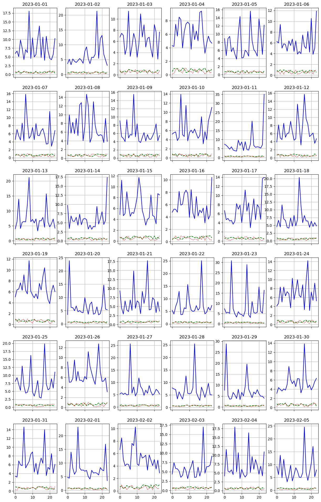

# Code for: Dynamic Pricing of Traffic Data: A Multi-Objective Optimization Approach

This repository contains the Python code implementing the dynamic pricing framework for traffic data as described in the paper **"[Your Paper Title Here: Dynamic Pricing of Traffic Data: A Multi-Objective Optimization Approach]"** (Replace with the actual paper title and add a link if available).

## Experimental 1 Synthetic Experiment Overview

This code provides a practical implementation of a dynamic pricing strategy for traffic data. It incorporates several key components:

* **Synthetic Data Generation:** Creates a realistic-like traffic data stream.
* **Spatiotemporal Data Valuation:** Implements a model to assess the value of traffic data based on temporal and spatial factors.
* **Demand Prediction:** Utilizes a simple linear regression model to forecast the demand for traffic data.
* **Multi-Objective Optimization:** Employs the DEAP (Distributed Evolutionary Algorithms in Python) library to find optimal pricing strategies by considering multiple objectives such as revenue, user cost, data quality, and price fairness.
* **Dynamic Pricing Application:** Applies the optimized price factors to the traffic data.
* **Visualization:** Generates charts to visualize the dynamic pricing results alongside traffic speed and volume.

This implementation serves as a demonstration and a starting point for further research and development in the area of dynamic traffic data pricing.

## Key Features

* **End-to-end Dynamic Pricing Framework:**  Covers data acquisition, valuation, demand prediction, optimization, and pricing.
* **Multi-Objective Optimization using DEAP:**  Leverages a powerful evolutionary computation library.
* **Modular Design:**  The code is structured into functions for easy understanding and modification.
* **Visualization of Results:** Provides visual insights into the impact of dynamic pricing.

## Relationship to the Paper

This code directly implements the concepts and methodologies discussed in the paper **"[Your Paper Title Here: Dynamic Pricing of Traffic Data: A Multi-Objective Optimization Approach]"**. Specifically:

* **Data Valuation Model:** The `temporal_value`, `spatial_value`, and `quality_factor_calculation` functions implement the spatiotemporal value model described in the paper (likely in a section discussing data valuation).
* **Demand Prediction:** The use of `LinearRegression` corresponds to the demand prediction techniques discussed in the paper.
* **Multi-Objective Optimization with DEAP:** The code utilizes DEAP to perform multi-objective optimization, aiming to balance the objectives outlined in the paper (revenue, cost, quality, fairness).
* **Dynamic Pricing Logic:** The final section of the `run_dynamic_pricing_experiment` function applies the optimized price factors to calculate the dynamic price.

**To fully understand the context and rationale behind this code, please refer to the original paper.**

## Getting Started

Follow these instructions to set up and run the code on your local machine.

### Prerequisites

Ensure you have Python 3.6 or higher installed. You will also need the following Python libraries:

* pandas
* numpy
* scikit-learn
* DEAP
* matplotlib
* seaborn

You can install these libraries using pip:

```bash
pip install pandas numpy scikit-learn deap matplotlib seaborn
```

## Code Explanation

The main parts of the code are as follows:

* **`run_dynamic_pricing_experiment()` function:**
    * **Data Acquisition:** Generates a synthetic `pandas` DataFrame representing traffic data with features like timestamp, location, speed, volume, and incidents.
    * **Data Valuation:** Implements the spatiotemporal value model using the `temporal_value`, `spatial_value`, `quality_factor_calculation`, and `calculate_data_value` functions. It calculates a value for each data point based on these factors.
    * **Demand Prediction:** Trains a `LinearRegression` model using `scikit-learn` to predict traffic volume based on the hour of the day and the day of the week.
    * **Multi-Objective Optimization:**
        * Uses the `deap` library to define the fitness function (`evaluate`), individual representation, and optimization operators (mutation, crossover, selection).
        * The `evaluate` function calculates the objectives: revenue, user cost (price), data quality, and a fairness penalty based on the price factor.
        * The `run_optimization` function executes the `eaSimple` algorithm from `deap` to find the best price factor for a given data point.
    * **Dynamic Pricing:** Iterates through the traffic data, runs the optimization for each data point, and applies the resulting optimal price factor to calculate the `dynamic_price`.
* **`visualize_dynamic_pricing()` function:**
    * Takes the DataFrame with dynamic prices as input.
    * Aggregates the data by date and hour to calculate mean prices, speeds, and volumes.
    * Generates a series of subplots using `matplotlib` to visualize the dynamic price, normalized speed, and normalized volume for each day.
    * Saves the visualization as a `dynamic_pricing.pdf` file.
* **`if __name__ == "__main__":` block:**
    * Calls the `run_dynamic_pricing_experiment()` function to get the traffic data with dynamic prices.
    * Prints the first few rows of the DataFrame.
    * Calls the `visualize_dynamic_pricing()` function to generate the visualization.

## Usage

After running the `dynamic_pricing.py` script, you will find:

* **Terminal output:** Showing the head of the `traffic_data` DataFrame with the calculated `dynamic_price`.
* **`dynamic_pricing.pdf` file:** Containing the visualizations of the dynamic pricing results.

You can modify the parameters within the script (e.g., the number of generations in the optimization, the parameters of the valuation model) to experiment with different settings and observe their impact on the dynamic pricing outcomes.



## Dependencies

* pandas
* numpy
* scikit-learn
* DEAP
* matplotlib
* seaborn

## Future Work

Possible extensions and improvements to this code include:

* **Using real-world traffic data:** Replacing the synthetic data generation with a connection to a real traffic data source.
* **Implementing more sophisticated demand prediction models:** Exploring other machine learning models for demand forecasting.
* **Refining the multi-objective optimization setup:** Experimenting with different objective weights and optimization algorithms.
* **Adding more sophisticated visualization techniques:** Exploring interactive dashboards or more detailed visualizations.
* **Integrating with a simulation environment:** Testing the dynamic pricing framework in a simulated traffic environment.

## License

[Specify the license under which this code is released. For example, MIT License, Apache 2.0 License, etc.]


Here's a breakdown of the thought process to create the GitHub README.md file for the provided Python code:

1. **Understand the Purpose:** The goal is to create a clear and informative README for a GitHub repository containing code that implements a dynamic pricing strategy for taxi data using multi-objective optimization. The target audience is likely other researchers, developers, or anyone interested in replicating or understanding the work.

2. **Identify Key Information:**  What are the most important aspects to highlight?
    * The core problem being addressed (dynamic pricing of taxi data).
    * The main technique used (multi-objective optimization).
    * The libraries involved (pandas, numpy, pymoo).
    * The overall workflow and components of the system.
    * Instructions on how to run the code.
    * How the code relates to the paper.
    * Potential areas for future work.
    * Licensing and citation information.

3. **Structure the README:**  A standard README structure is helpful for readability. A logical flow would be:
    * Title (clear and descriptive)
    * Overview/Introduction
    * Key Features
    * Relationship to the Paper
    * Getting Started (Prerequisites, Installation, Running)
    * Code Explanation (High-level breakdown of the code sections)
    * Usage (What to expect when running the code)
    * Dependencies
    * Future Work
    * License
    * Citation

4. **Draft Content for Each Section:**

    * **Title:** Start with a clear title that includes the paper's essence and the fact that it's code. Something like "Code for: [Paper Title]".

    * **Overview:**  A brief summary of what the code does and the approach taken. Mention the key libraries.

    * **Key Features:** List the most important functionalities of the code as bullet points.

    * **Relationship to the Paper:**  This is crucial. Explain how the code maps back to the concepts and methods described in the associated research paper. Be specific about which parts of the code implement which parts of the paper.

    * **Getting Started:**
        * **Prerequisites:** List all necessary software and libraries.
        * **Installation:** Provide step-by-step instructions on cloning the repository and installing dependencies (using `pip`).
        * **Running:** Explain how to execute the main script and what to expect as output. Include the example output provided.

    * **Code Explanation:** Provide a high-level overview of the different sections of the Python code (Data Valuation, Demand Prediction, Multi-Objective Optimization, Dynamic Pricing, Feedback). Briefly describe the purpose of each section. *Initial thought: Should I go into detail about the individual functions?  Decision: No, keep it high-level to avoid making the README too long. Users can read the code for details.*

    * **Usage:** Describe what the user will see or get after running the code (terminal output, potential files generated).

    * **Dependencies:**  Reiterate the list of dependencies for clarity.

    * **Future Work:** Suggest potential areas for improvement or further development. This shows that the project is open to expansion.

    * **License:**  Emphasize the importance of including a license.

    * **Citation:** Provide clear instructions on how to cite the paper if the code is used in research. Include a BibTeX example.

5. **Refine and Format:**
    * Use Markdown syntax for headings, bullet points, code blocks, and emphasis.
    * Ensure consistent formatting throughout the document.
    * Use clear and concise language.
    * Double-check for typos and grammatical errors.
    * Make sure the example output matches what the user will actually see.

6. **Self-Correction/Improvements During the Process:**

    * *Initial thought:* Just list the code files. *Correction:*  A README needs more context than just a list of files. It needs to explain *what* the code does and *how* to use it.
    * *Initial thought:*  Go into deep technical detail about the algorithms. *Correction:* Keep it at a high-level overview. The paper is the place for deep technical details. The README should be accessible to a broader audience.
    * *Realization:* The provided code snippets show example output. Include this in the "Running" section to help users verify their setup.
    * *Emphasis:*  Make sure the connection to the research paper is explicitly stated and explained.

By following this process, the goal is to create a comprehensive and user-friendly README.md file that effectively communicates the purpose, functionality, and usage of the provided Python code.```markdown


## Experimental 2 Real-World Taxi Trip Data Experiment Overview

This code implements a dynamic pricing strategy for taxi data, leveraging multi-objective optimization to balance various objectives such as revenue maximization, user cost minimization, data quality, and market fairness. The framework consists of several key components:

* **Data Valuation:**  Calculates the value of taxi trip data based on temporal, spatial, and quality factors.
* **Demand Prediction:** Predicts the demand for taxi services based on time of day and location (using a simplified placeholder in this implementation).
* **Multi-Objective Optimization:** Employs the NSGA-II algorithm from the `pymoo` library to find a set of Pareto-optimal prices.
* **Dynamic Pricing:** Determines a specific price from the Pareto front based on a chosen strategy.
* **Real-time Feedback Mechanism:**  Simulates a basic feedback loop to demonstrate how the system could adapt based on market response.

This implementation serves as a practical demonstration of the concepts discussed in the paper.

## Key Features

* **Multi-Objective Optimization with `pymoo`:** Utilizes the powerful `pymoo` library for multi-objective optimization, specifically the NSGA-II algorithm.
* **Modular Design:** The code is organized into functions representing different components of the dynamic pricing framework.
* **Simulation of Real-time Feedback:** Includes a basic simulation of how feedback can be incorporated to update the system.
* **Clear Implementation of Core Concepts:** Provides a clear and understandable implementation of the data valuation and dynamic pricing logic.

## Relationship to the Paper

This code directly implements the methodologies and concepts presented in the paper **"[Your Paper Title Here]"**. Specifically, the code demonstrates:

* **Data Valuation Model:** The `calculate_temporal_value`, `calculate_spatial_value`, `calculate_quality_factor`, and `evaluate_data_value` functions implement the data valuation model discussed in the paper.
* **Demand Prediction (Placeholder):** The `predict_demand` function provides a simplified placeholder for a more sophisticated demand prediction model as described in the paper.
* **Multi-Objective Optimization using NSGA-II:** The `DynamicPricingProblem` class and the `optimize_price` function demonstrate the application of the NSGA-II algorithm to find optimal price points.
* **Dynamic Pricing Strategy:** The `determine_price` function showcases a basic strategy for selecting a price from the Pareto front.
* **Real-time Feedback (Simulation):** The `collect_feedback` and `update_models` functions illustrate a rudimentary feedback mechanism.

**To fully understand the context and rationale behind this code, please refer to the original paper.**

## Getting Started

Follow these instructions to set up and run the code on your local machine.

### Prerequisites

Ensure you have Python 3.6 or higher installed. You will also need the following Python libraries:

* pandas
* numpy
* pymoo

You can install these libraries using pip:

```bash
pip install pandas numpy pymoo
```

### Installation

1. Clone this repository to your local machine:

   ```bash
   git clone [repository URL]
   cd [repository directory]
   ```

2. **Place Data Files:** Ensure the following CSV files are in the same directory as the Python script:
   * `original_cleaned_nyc_taxi_data_2018.csv`
   * `taxi_trip_data.csv`
   * `taxi_zone_geo.csv`
   *(Note: You may need to obtain these datasets separately. If they are publicly available, provide links here.)*

3. (Optional) Create a virtual environment to manage dependencies:

   ```bash
   python -m venv venv
   source venv/bin/activate  # On Linux/macOS
   venv\Scripts\activate  # On Windows
   ```

4. Install the required libraries (if you haven't already):

   ```bash
   pip install -r requirements.txt
   ```
   *(Note: You might need to create a `requirements.txt` file with the library names.)*

### Running the Code

To run the dynamic pricing simulation, execute the following Python script:

```bash
python your_script_name.py  # Replace your_script_name.py with the actual file name
```

You should see output similar to this:

```
Assessing data value for a sample trip:
Data value for the sample trip: 181.40

Simulating dynamic real-time pricing:
Suggested Price: $99.78
Collected feedback: Price=99.77879852458423, Actual Demand=-3.738939926229212, Satisfaction=0.4
Models updated based on feedback.
```

## Code Explanation

The main parts of the code are as follows:

* **Import Statements:** Imports necessary libraries.
* **Data Loading:** Loads the taxi data from the provided CSV files. **Make sure these files are present in the same directory.**
* **System Architecture Components:**
    * **Data Valuation:** Functions (`calculate_temporal_value`, `calculate_spatial_value`, `calculate_quality_factor`, `evaluate_data_value`) to assess the value of taxi trip data.
    * **Demand Prediction:** A placeholder function (`predict_demand`) for predicting taxi demand. **Note:** This is a simplified example and would require a more sophisticated model in a real-world application.
    * **Multi-Objective Optimization:**
        * `DynamicPricingProblem` class: Defines the optimization problem for `pymoo`, specifying the objectives (revenue, user cost, data quality, market fairness) and the decision variable (price).
    * **Dynamic Pricing:** The `determine_price` function implements a basic strategy to select a price from the Pareto front generated by the optimization.
    * **Real-time Feedback Mechanism:** Placeholder functions (`collect_feedback`, `update_models`) to simulate the collection and use of feedback data.
* **Data Characteristics and Value Assessment:** The `assess_data_value_for_trip` function applies the data valuation model to a sample taxi trip.
* **Demand Prediction Model:** (As mentioned, the `predict_demand` function is a basic placeholder).
* **Dynamic Price Optimization:** The `optimize_price` function sets up and runs the NSGA-II optimization algorithm using `pymoo`.
* **Real-time Feedback Mechanism:** The `simulate_real_time_pricing` function demonstrates a single iteration of the dynamic pricing and feedback process.
* **Main Execution (`if __name__ == "__main__":`)**:
    * Assesses and prints the data value for a sample trip.
    * Simulates the dynamic real-time pricing process.

## Usage

After running the script, you will see output in the console showing:

* The calculated data value for a sample taxi trip.
* The suggested price from the optimization.
* Simulated feedback data.
* A message indicating that the models have been updated (in a real system, this would trigger model retraining).

You can modify the parameters within the code (e.g., the objective function weights, the optimization algorithm parameters) to experiment with different dynamic pricing strategies.

## Dependencies

* pandas
* numpy
* pymoo

## Future Work

Possible extensions and improvements to this code include:

* **Implementing a more sophisticated demand prediction model:** Replacing the placeholder `predict_demand` function with a machine learning model trained on historical data.
* **Integrating real-time data sources:** Connecting the framework to live traffic and taxi data streams.
* **Developing more advanced strategies for selecting prices from the Pareto front:** Implementing different criteria for choosing the optimal price based on specific business goals.
* **Building a more robust feedback mechanism:** Implementing a system to collect and process real user feedback to continuously improve the pricing models.
* **Visualizing the optimization results:** Adding code to visualize the Pareto front and the trade-offs between different objectives.

## License

[Specify the license under which this code is released. For example, MIT License, Apache 2.0 License, etc.]


```
